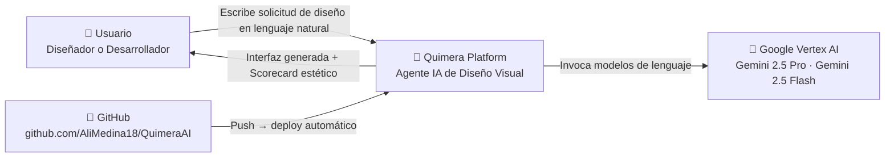
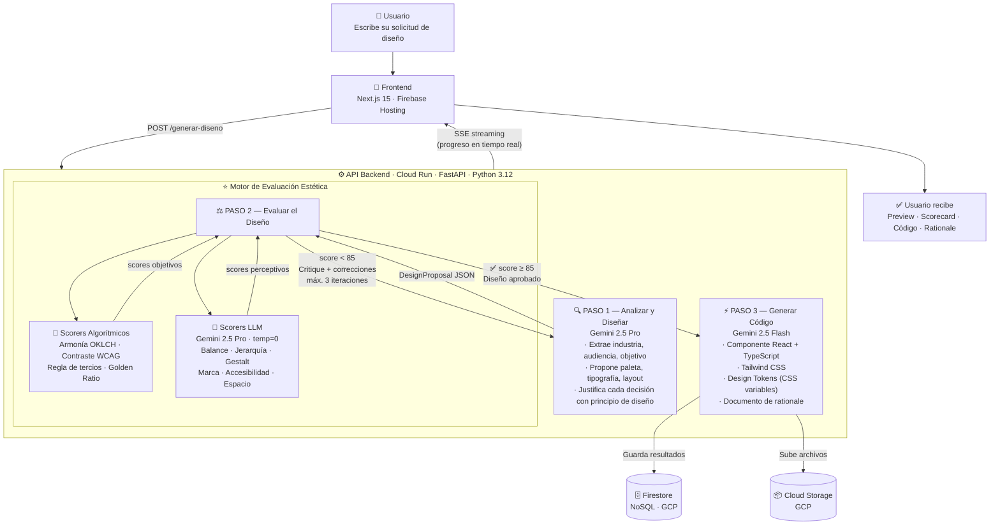
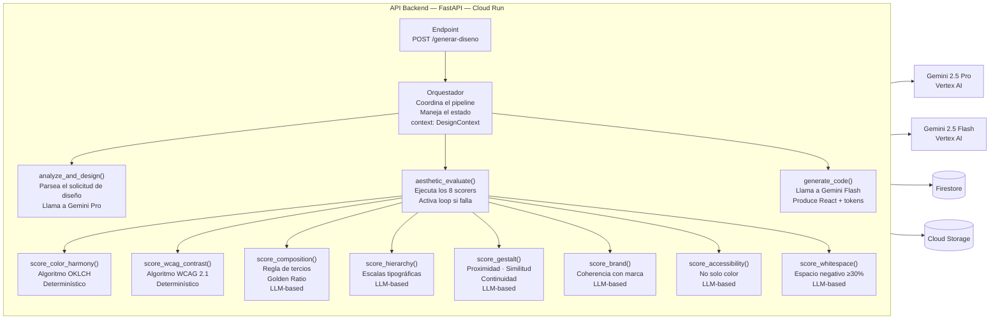

# PROYECTO QUIMERA — PLAN MAESTRO DE ARQUITECTURA Y EJECUCIÓN

> **Competencia:** Google AI Startup Agents Challenge
> **Deadline:** Jueves 11 de Junio de 2026, 7:00 pm
> **Ventana de desarrollo:** 7 días (Jue 4 Jun, 8am → Jue 11 Jun, 7pm)
> **Repositorio:** https://github.com/AliMedina18/QuimeraAI
> **Ruta local:** `C:\Users\USUARIO\Documents\Github\QuimeraAI`
> **Autora:** Alicia Medina

---

## ÍNDICE

1. [¿Qué es Quimera y qué problema resuelve?](#1-qué-es-quimera-y-qué-problema-resuelve)
2. [Glosario de términos clave](#2-glosario-de-términos-clave)
3. [Visión Técnica del Sistema](#3-visión-técnica-del-sistema)
4. [Arquitectura del Sistema — MVP](#4-arquitectura-del-sistema--mvp)
5. [Stack Tecnológico](#5-stack-tecnológico)
6. [Diseño de Base de Datos](#6-diseño-de-base-de-datos)
7. [Estrategia de Agentes](#7-estrategia-de-agentes)
8. [Motor de Evaluación Estética](#8-motor-de-evaluación-estética)
9. [Evaluación del Modelo y Plan de Pruebas](#9-evaluación-del-modelo-y-plan-de-pruebas)
10. [Plan Día por Día — 4 al 11 de Junio](#10-plan-día-por-día)
11. [Repositorio y Entorno de Desarrollo](#11-repositorio-y-entorno-de-desarrollo)

---

## 1. ¿Qué es Quimera y qué problema resuelve?

### 1.1 El problema empresarial

Hoy existen herramientas de inteligencia artificial que generan interfaces digitales a partir de una descripción en texto (v0, Bolt, Lovable, Figma AI). Son rápidas y útiles, pero tienen una falla estructural que ninguna ha resuelto:

**Generan interfaces funcionales, pero no verifican si son visualmente correctas.**

En la práctica esto significa que:

- Un desarrollador genera una landing page con IA y los colores no tienen ninguna relación cromática entre sí.
- Un botón de acción compite visualmente con el título, porque nadie verificó la jerarquía.
- El contraste entre el texto y el fondo es tan bajo que personas con visión reducida no pueden leerlo.
- La pantalla se ve sobrecargada porque no se respetó ningún principio de composición.

El resultado: el equipo de desarrollo termina llamando a un diseñador para corregir lo que la IA generó. Se pierde tiempo, dinero y la promesa de automatización no se cumple.

**¿Por qué pasa esto?** Porque los modelos de lenguaje aprenden patrones estadísticos de interfaces existentes, pero no razonan sobre los principios que hacen que un diseño sea visualmente correcto. No conocen la teoría del color, no aplican las leyes de composición, no evalúan la jerarquía visual antes de generar.

### 1.2 La solución: Quimera

Quimera es un agente de inteligencia artificial especializado en diseño visual que **evalúa el diseño antes de generarlo**.

A diferencia de otras herramientas, Quimera incorpora un **Motor de Razonamiento Estético**: un sistema que verifica 8 criterios profesionales de diseño antes de producir una sola línea de código. Si algo falla, el sistema se corrige solo. Solo cuando el diseño pasa la evaluación, se genera el código.

El resultado es una interfaz que no solo funciona, sino que está visualmente bien construida, siguiendo los mismos principios que usaría un diseñador experto.

### 1.3 Hipótesis central (demostrable en la competencia)

> Una interfaz generada por un sistema que evalúa principios de diseño antes de construir produce resultados cuantitativamente superiores a una interfaz generada directamente, medible en 8 criterios objetivos de 0 a 100.

---

## 2. Glosario de términos clave

Estos términos aparecen a lo largo del documento. Se definen aquí para que cualquier lector, técnico o no, pueda seguir el contenido.

| Término | Qué significa en Quimera |
|---|---|
| **Solicitud de diseño** | La descripción en lenguaje natural que escribe el usuario sobre lo que quiere crear. Ejemplo: *"Necesito una página de inicio para mi app de finanzas. Colores: azul y blanco. Público: jóvenes de 25-35 años."* No se necesita saber de diseño ni de código para escribir una solicitud de diseño. |
| **Design Token** | Las variables que definen el sistema visual de una interfaz: colores específicos (ej. `--color-primary: #1E40AF`), tamaños de fuente, espaciados. Son el "idioma" que conecta las decisiones de diseño con el código. |
| **Design System** | El conjunto completo de reglas visuales de una marca: colores, tipografías, componentes, espaciados. Quimera genera un design system básico por proyecto. |
| **Pipeline** | La secuencia de pasos que sigue Quimera para procesar el solicitud de diseño del usuario y entregar el resultado. En el MVP son 3 pasos: Analizar → Evaluar → Generar. |
| **Scorecard estético** | El tablero de puntuaciones que Quimera genera al evaluar un diseño. Muestra los 8 criterios con su nota de 0 a 100 y una explicación de qué falla y por qué. |
| **Loop de corrección** | Cuando el diseño no alcanza el puntaje mínimo (≥85), Quimera no se detiene: genera un diagnóstico, vuelve al paso anterior y corrige. Esto se repite hasta 3 veces. |
| **WCAG** | Web Content Accessibility Guidelines. Estándar internacional que define qué tan legible debe ser el texto según el contraste entre su color y el fondo. El mínimo exigido es 4.5:1 para texto normal. |
| **OKLCH** | Un espacio de color matemático que representa los colores como lo percibe el ojo humano. Se usa para calcular armonías cromáticas con mayor precisión que el RGB o el HSL tradicional. |
| **Gestalt** | Conjunto de leyes de percepción visual que explican cómo el cerebro humano organiza lo que ve. Quimera las aplica para verificar si los elementos de la interfaz se agrupan y se perciben correctamente. |
| **Regla de los tercios** | Principio de composición que divide la pantalla en una cuadrícula de 3×3. Los elementos principales deben ubicarse en las intersecciones o líneas de esta cuadrícula para lograr un balance visual natural. |
| **Número áureo (Golden Ratio)** | La proporción matemática 1.618, presente en la naturaleza y en el arte clásico. Quimera la aplica para verificar que las proporciones de secciones y elementos sean visualmente armónicas. |
| **Ratio de contraste** | El número que mide qué tan diferente es la luminosidad de dos colores. Blanco sobre negro = 21:1 (máximo). Gris claro sobre blanco = 1.4:1 (ilegible). |
| **SSE (Server-Sent Events)** | Tecnología que permite al servidor enviar actualizaciones al navegador en tiempo real, sin que el usuario tenga que refrescar la página. Quimera la usa para mostrar el proceso en vivo. |

---

## 3. Visión Técnica del Sistema

Quimera opera en tres capas que se ejecutan en secuencia para cada solicitud:

```
Capa 1 — COMPRENSIÓN
  Interpreta el solicitud de diseño del usuario.
  Extrae: industria, audiencia, objetivos, restricciones de marca.
  Propone: paleta de colores, tipografía, tipo de layout.
  Justifica cada propuesta con el principio de diseño que la sustenta.

Capa 2 — RAZONAMIENTO ESTÉTICO  ← El diferenciador
  Evalúa la propuesta del Paso 1 antes de generar código.
  Aplica 8 criterios profesionales de diseño (0-100 por criterio).
  Si el promedio es menor a 85: genera diagnóstico y corrige.
  Solo aprueba cuando el diseño cumple los estándares.

Capa 3 — GENERACIÓN
  Solo se ejecuta con diseño aprobado.
  Genera: componente React + TypeScript + Tailwind CSS.
  Genera: design tokens (variables CSS).
  Genera: documento de rationale (por qué se tomó cada decisión).
```

**¿Por qué necesita estas tres capas?**

La Capa 1 existe porque el usuario no siempre tiene toda la información de diseño estructurada: Quimera la infiere del contexto. La Capa 2 existe porque sin evaluación previa, la generación produce resultados inconsistentes. La Capa 3 existe separada de las otras porque el código debe reflejar exactamente las decisiones que ya fueron validadas — no inventar nada nuevo.

---

## 4. Arquitectura del Sistema — MVP

### 4.1 Diagrama de Contexto del Sistema



### 4.2 Diagrama del Pipeline (Flujo principal)



### 4.3 Diagrama de Componentes del Backend



---

## 5. Stack Tecnológico

### 5.1 Modelos de IA

| Componente | Modelo | Alcance MVP |
|---|---|---|
| Analizar solicitud de diseño + proponer diseño (Paso 1) | Gemini 2.5 Pro | ✅ En scope |
| Evaluación estética LLM (Paso 2) | Gemini 2.5 Pro · temperatura=0 | ✅ En scope |
| Scorers algorítmicos — color y contraste (Paso 2) | Python puro | ✅ En scope |
| Generación de código React (Paso 3) | Gemini 2.5 Flash | ✅ En scope |
| Análisis visual de imágenes de marca | Gemini 2.5 Pro Vision | ❌ Post-MVP |
| Embeddings + búsqueda semántica (RAG) | text-embedding-004 | ❌ Post-MVP |

### 5.2 Backend

```
Lenguaje            Python 3.12
Framework API       FastAPI
Estructura          Pipeline secuencial de 3 pasos (sin orquestador externo en MVP)
Modelos Pydantic    DesignContext · DesignProposal · AestheticScores · GeneratedOutput
Async               asyncio (para llamadas concurrentes a Gemini)
Empaquetado         Docker → imagen publicada en Artifact Registry → Cloud Run
```

### 5.3 Frontend

```
Framework           Next.js 15 (App Router)
Estilos             Tailwind CSS + shadcn/ui
Streaming           Server-Sent Events (SSE) para mostrar progreso en tiempo real
Preview             iframe sandbox aislado que renderiza el componente generado
Hosting             Firebase Hosting
```

### 5.4 Persistencia

```
Base de datos       Firestore (NoSQL jerárquico · Google Cloud)
Archivos generados  Cloud Storage (buckets separados por tipo)
Secretos            Secret Manager (claves de API · credenciales GCP)
```

### 5.5 Herramientas de Desarrollo

```
CI/CD               Cloud Build → auto-deploy al hacer push a rama main en GitHub
Repositorio         GitHub · github.com/AliMedina18/QuimeraAI
Control de versiones Git
Testing             pytest (backend) · Vitest (frontend)
Monitoreo           Cloud Monitoring + Cloud Logging
```

### 5.6 Librerías Python clave para el Motor Estético

```
colour-science      Cálculos en espacio OKLCH · armonías cromáticas · círculo cromático
colorspacious       Transformaciones de espacio de color CIELab/OKLCH
Pillow              Análisis de imágenes de marca (post-MVP, preparar estructura)
pydantic            Validación de todos los modelos de datos
google-generativeai SDK oficial de Gemini
google-cloud-aiplatform SDK de Vertex AI
fastapi + uvicorn   Servidor web asíncrono
python-dotenv       Variables de entorno locales
```

---

## 6. Diseño de Base de Datos

### 6.1 ¿Por qué Firestore (NoSQL) y no una base de datos relacional (SQL)?

Una base de datos relacional (como PostgreSQL o MySQL) organiza los datos en tablas con filas y columnas fijas, y las relaciona mediante claves externas. Es ideal cuando los datos tienen estructura rígida y predecible.

Quimera no encaja en ese modelo por estas razones:

**El esquema varía por proyecto.** Cada proyecto puede tener diferentes campos de `design_specs` dependiendo del tipo de interfaz (landing page, dashboard, app móvil). En SQL esto requeriría columnas opcionales o tablas adicionales. En Firestore, cada documento simplemente tiene los campos que necesita.

**La estructura es jerárquica, no relacional.** Un proyecto contiene sus propios puntajes estéticos, sus propias specs de diseño y sus propios outputs generados. No hay relaciones cruzadas entre proyectos. Firestore permite anidar sub-colecciones directamente dentro del documento padre, reflejando exactamente esta jerarquía.

**Las actualizaciones deben ser en tiempo real.** Firestore tiene listeners en tiempo real nativos, lo que encaja con el SSE streaming del pipeline. Cada vez que el backend escribe un puntaje nuevo, el frontend puede recibirlo instantáneamente.

**Sin necesidad de JOINs.** Todas las consultas de Quimera son del tipo "dame todos los datos de este proyecto", nunca "combina datos de 5 tablas distintas". Firestore es más eficiente para este patrón.

### 6.2 Estructura jerárquica de documentos

Firestore organiza los datos como documentos anidados en colecciones. La estructura de Quimera es la siguiente:

```
/users/{userId}
│   email: string
│   plan: "free" | "pro"
│   created_at: timestamp
│
└── /projects/{projectId}
    │   user_id: string
    │   name: string
    │   solicitud de diseño: string                    ← La descripción original del usuario
    │   status: "procesando" | "listo" | "error"
    │   created_at: timestamp
    │   updated_at: timestamp
    │
    ├── /brand_context                   ← Contexto de marca extraído del solicitud de diseño
    │       primary_color: string        ← Ej: "#1E40AF"
    │       secondary_color: string
    │       accent_color: string
    │       neutral_palette: array<string>
    │       typography_heading: string   ← Ej: "Inter Bold"
    │       typography_body: string
    │       brand_personality: array<string>  ← ["moderno", "confiable", "minimalista"]
    │       target_audience: string
    │       color_harmony_type: string   ← "complementario" | "análogo" | "triádico"
    │
    ├── /design_specs                    ← Decisiones de composición
    │       layout_type: string          ← "landing_page" | "dashboard" | "app"
    │       grid_system: string          ← "12-col" | "asimétrico" | "bento"
    │       composition_rule: string     ← "rule_of_thirds" | "golden_ratio"
    │       sections: array<object>      ← Secciones con peso visual asignado
    │       spacing_scale: array<number> ← Ej: [4, 8, 16, 24, 32, 48, 64]
    │
    ├── /aesthetic_scores/{evaluationId} ← Una entrada por cada iteración del loop
    │       iteration: number            ← 1, 2 o 3
    │       timestamp: timestamp
    │       color_harmony: number        ← 0-100
    │       wcag_contrast: number        ← 0-100
    │       composition_balance: number  ← 0-100
    │       visual_hierarchy: number     ← 0-100
    │       gestalt_compliance: number   ← 0-100
    │       brand_consistency: number    ← 0-100
    │       accessibility: number        ← 0-100
    │       whitespace_quality: number   ← 0-100
    │       overall_score: number        ← promedio ponderado
    │       passed: boolean              ← true si overall ≥ 85
    │       critique: string             ← explicación de qué falló y por qué
    │
    └── /generated_outputs/{outputId}   ← Resultado final (solo si passed=true)
            type: "react" | "tokens" | "rationale"
            storage_url: string          ← URL del archivo en Cloud Storage
            model_used: string
            generation_time_ms: number
            timestamp: timestamp
```

### 6.3 Estructura de Cloud Storage

```
gs://quimera-assets/
  users/{userId}/logos/
  users/{userId}/brand_assets/

gs://quimera-outputs/
  projects/{projectId}/
    componente.tsx          ← Componente React generado
    tokens.css              ← Design tokens como variables CSS
    rationale.md            ← Explicación de cada decisión de diseño
    preview.png             ← Captura del resultado (post-MVP)
```

---

## 7. Estrategia de Agentes

### 7.1 El Contexto de Diseño Compartido (DesignContext)

El estado del sistema es un objeto Python que se construye progresivamente durante el pipeline. Cada paso lo lee, lo enriquece y lo pasa al siguiente. Es la "memoria de trabajo" de Quimera:

```python
class DesignContext(BaseModel):
    # Campos llenados en el Paso 1 (Análisis)
    solicitud de diseño: str                           # Descripción original del usuario
    project_type: str                    # landing_page · dashboard · app
    industry: str                        # fintech · healthtech · e-commerce...
    target_audience: str                 # Descripción de la audiencia objetivo
    brand_personality: list[str]         # ["moderno", "confiable", "accesible"]
    
    # Propuesta de diseño (generada en Paso 1, refinada si hay corrección)
    primary_color: str | None = None     # Hex + justificación
    secondary_color: str | None = None
    accent_color: str | None = None
    neutral_palette: list[str] = []
    heading_font: str | None = None
    body_font: str | None = None
    layout_type: str | None = None
    composition_rule: str | None = None  # rule_of_thirds · golden_ratio
    color_harmony_type: str | None = None
    design_rationale: dict = {}          # {campo: "principio aplicado"}
    
    # Resultados de evaluación (llenados en Paso 2)
    aesthetic_scores: dict = {}          # {criterio: puntuación}
    overall_score: float | None = None
    critique: str | None = None          # Qué falla y por qué
    approved: bool = False
    iteration: int = 0                   # Número de iteración (máx. 3)
    
    # Código generado (llenado en Paso 3)
    react_component: str | None = None
    design_tokens_css: str | None = None
    rationale_document: str | None = None
```

### 7.2 Flujo de Control Secuencial

El pipeline es una máquina de estados finita (FSM): un sistema que avanza de estado en estado siguiendo reglas claras. No hay paralelismo en el MVP porque cada paso depende del resultado del anterior.

```
ESTADO INICIAL: solicitud de diseño recibido
    ↓
PASO 1: analyze_and_design(context)
    → Llama a Gemini 2.5 Pro con el solicitud de diseño
    → Rellena los campos de diseño en DesignContext
    → Siguiente estado: design_proposed
    ↓
PASO 2: aesthetic_evaluate(context)
    → Ejecuta los 8 scorers
    → Calcula overall_score
    ↓ ¿overall_score ≥ 85?
    NO (y iteration < 3) → context.critique = "..." → context.iteration += 1 → vuelve al PASO 1
    NO (y iteration = 3) → devuelve el mejor resultado con advertencia
    SÍ → context.approved = True → siguiente estado: design_approved
    ↓
PASO 3: generate_code(context)
    → Llama a Gemini 2.5 Flash con el contexto aprobado
    → Rellena react_component, design_tokens_css, rationale_document
    → Siguiente estado: completed
    ↓
Guardar en Firestore + Cloud Storage
Enviar resultado via SSE al frontend
```

### 7.3 Estrategia de Prompting por Paso

**Paso 1 — Razonamiento explícito obligatorio:**

El prompt instruye al modelo a justificar cada decisión antes de tomarla. Sin justificación, la propuesta se rechaza automáticamente.

```
Eres un diseñador visual senior con dominio de teoría del color (Itten, OKLCH),
composición (Golden Ratio, Regla de los tercios) y psicología de la Gestalt.

REGLA OBLIGATORIA: Antes de proponer cualquier valor (color, tipografía, layout),
debes indicar el principio de diseño que lo justifica.

Formato de respuesta: JSON con campos {valor, principio, razon}
para cada decisión.
```

**Paso 2 — Evaluación determinista (temperatura cero):**

```
Eres un auditor de diseño visual. Evalúa la siguiente propuesta con temperatura=0.
Para cada criterio, asigna una puntuación exacta (0-100) y escribe una justificación
de máximo 2 líneas. No uses rangos ni aproximaciones.

Si la puntuación es menor a 85, indica exactamente qué debe cambiar y qué valor
específico resolvería el problema (ej: "cambiar #3D3D3D a #FFFFFF para pasar de
contraste 1.4:1 a 15:1").
```

**Paso 3 — Generación con restricciones estrictas:**

```
Genera un componente React funcional usando EXACTAMENTE los valores aprobados
en el DesignContext. No puedes introducir valores de color, tipografía o espaciado
que no estén en el contexto. Usa Tailwind CSS utilities exclusivamente.
TypeScript strict mode. Sin CSS personalizado.
```

---

## 8. Motor de Evaluación Estética

El Motor de Evaluación Estética es el componente diferenciador de Quimera. Antes de generar cualquier línea de código, evalúa la propuesta de diseño en **8 criterios** organizados en 3 grupos. Cada criterio recibe una puntuación de **0 a 100**. El promedio debe alcanzar **≥ 85** para que el diseño sea aprobado.

### Resumen de los 8 criterios

| # | Criterio | En palabras simples | Grupo | Método |
|---|---|---|---|---|
| 1 | **Armonía cromática** | ¿Los colores del diseño se llevan bien entre sí según el círculo cromático? | 🎨 Color | Algoritmo OKLCH |
| 2 | **Contraste WCAG** | ¿El texto es suficientemente legible sobre el color de fondo? (estándar internacional) | 🎨 Color | Algoritmo WCAG 2.1 |
| 3 | **Balance compositivo** | ¿El peso visual está bien distribuido en la pantalla? | 📐 Composición | LLM |
| 4 | **Jerarquía visual** | ¿Queda claro qué elemento es el más importante y cuál es secundario? | 📐 Composición | LLM |
| 5 | **Cumplimiento Gestalt** | ¿Los elementos relacionados se agrupan y perciben correctamente? | 📐 Composición | LLM |
| 6 | **Calidad del espacio negativo** | ¿El diseño tiene suficiente espacio vacío para respirar y no sentirse sobrecargado? | 📐 Composición | LLM |
| 7 | **Consistencia de marca** | ¿El resultado refleja la personalidad, colores y tono de la marca del usuario? | 🏷️ Identidad | LLM |
| 8 | **Accesibilidad general** | ¿Lo puede usar cualquier persona, incluyendo quienes tienen dificultades visuales? | 🏷️ Identidad | LLM |

> **Métodos de evaluación:**
> - **Algoritmo** = cálculo matemático exacto y determinístico. Siempre da el mismo resultado para los mismos colores.
> - **LLM** = evaluación mediante Gemini 2.5 Pro con temperatura=0 (sin aleatoriedad). Se usa para criterios que requieren percepción visual y juicio contextual.

---

### 8.1 Grupo 1 — COLOR (2 criterios algorítmicos · deterministas)

Estos dos criterios se calculan con algoritmos matemáticos exactos, sin intervención del modelo de lenguaje. Siempre producen el mismo resultado para los mismos colores de entrada.

---

**Criterio 1 — Armonía Cromática**

*¿Los colores del diseño forman una combinación visualmente coherente?*

El círculo cromático divide los colores por su tono (hue) en 360 grados. Las armonías clásicas definen relaciones angulares entre colores que el ojo humano percibe como coherentes:

| Tipo de armonía | Ángulo entre colores | Ejemplo |
|---|---|---|
| Complementaria | 180° (±15° tolerancia) | Azul y naranja |
| Análoga | 30° (±10° tolerancia) | Azul, azul-verde, verde |
| Triádica | 120° (±15° tolerancia) | Rojo, amarillo, azul |
| Tetrádica | 90° (±15° tolerancia) | Rojo, naranja, azul, verde |
| Monocromática | 0° (misma familia) | Azul oscuro, azul, azul claro |

**Herramienta:** Espacio de color OKLCH (Optical-perceptual Lightness, Chroma, Hue). OKLCH es superior a HSL porque su escala de luminosidad es perceptualmente uniforme: un incremento de 10 puntos en L siempre se percibe igual, independientemente del tono. Esto hace los cálculos de armonía más precisos.

```python
# Librería: colour-science (pip install colour-science)
import colour

def calculate_color_harmony_score(palette: list[str]) -> float:
    # 1. Convertir hexadecimales a OKLCH
    # 2. Extraer el ángulo de hue (H) de cada color
    # 3. Calcular diferencias angulares entre pares
    # 4. Verificar si corresponden a una armonía conocida (±tolerancia)
    # 5. Calcular penalización si la saturación es inconsistente
    # Retorna: float 0-100
```

---

**Criterio 2 — Contraste WCAG**

*¿El texto es legible sobre su fondo?*

El estándar WCAG 2.1 (Web Content Accessibility Guidelines) define el contraste mínimo entre texto y fondo para garantizar legibilidad:

- Texto normal (< 18pt): ratio mínimo **4.5:1**
- Texto grande (≥ 18pt o 14pt bold): ratio mínimo **3:1**
- Nivel AAA (máxima accesibilidad): **7:1**

El ratio se calcula comparando la luminancia relativa de los dos colores. Luminancia es el brillo percibido por el ojo humano, calculado con los pesos R: 0.2126 · G: 0.7152 · B: 0.0722.

```python
def calculate_wcag_ratio(foreground: str, background: str) -> float:
    # 1. Convertir hex a RGB lineal (gamma expansion)
    # 2. Calcular luminancia relativa de cada color
    # 3. Ratio = (L_claro + 0.05) / (L_oscuro + 0.05)
    # Negro/blanco = 21:1 · Gris #767676 / blanco = 4.48:1

def score_wcag_contrast(design: DesignProposal) -> float:
    # Evalúa todos los pares texto/fondo del diseño
    # Penaliza cada par que no alcance 4.5:1
    # Retorna: float 0-100
```

---

### 8.2 Grupo 2 — COMPOSICIÓN (4 criterios · LLM con prompts estructurados)

---

**Criterio 3 — Balance Compositivo**

*¿El peso visual está distribuido equilibradamente?*

El peso visual es la "fuerza de atracción" que tiene un elemento sobre el ojo. Elementos grandes, con alto contraste o saturación intensa tienen más peso. Una pantalla equilibrada distribuye ese peso de manera que ningún lado se sienta más "pesado" que el otro.

Herramientas aplicadas:
- **Regla de los tercios:** Divide la pantalla en cuadrícula 3×3. Los elementos con mayor peso visual deben ubicarse en las intersecciones de las líneas.
- **Número áureo (1.618):** Las proporciones de secciones principales deben acercarse a esta relación. Un bloque de contenido de 800px de alto con un bloque secundario de 494px (800/1.618) es áureo.
- **Simetría y asimetría intencional:** La simetría crea estabilidad. La asimetría crea dinamismo. Ambas son válidas, pero deben ser intencionales.

---

**Criterio 4 — Jerarquía Visual**

*¿El ojo sabe qué mirar primero, segundo y tercero?*

La jerarquía visual establece el orden de importancia de los elementos. Se evalúa:
- **Escala:** El elemento más importante debe ser al menos 1.25× más grande que el secundario (escala mínima en el sistema de tipografía modular).
- **Contraste tonal:** Los elementos importantes deben tener mayor contraste con el fondo que los secundarios.
- **Flujo F o Z:** La pantalla debe seguir los patrones naturales de lectura: patrón en F (para texto denso) o patrón en Z (para páginas de marketing).

---

**Criterio 5 — Cumplimiento Gestalt**

*¿Los elementos se agrupan y perciben como el diseñador pretende?*

Las leyes de Gestalt explican cómo el cerebro organiza la información visual. Quimera evalúa:

| Ley | Descripción | Lo que se evalúa |
|---|---|---|
| **Proximidad** | Los elementos cercanos se perciben como grupo | ¿El precio de un producto está más cerca de su nombre que del producto vecino? |
| **Similitud** | Los elementos con el mismo estilo se perciben como del mismo tipo | ¿Todos los botones primarios son iguales entre sí? |
| **Continuidad** | El ojo sigue líneas y curvas naturalmente | ¿El flujo de lectura sigue una dirección clara? |
| **Cierre** | El cerebro completa formas incompletas | ¿Hay formas inacabadas que se usan de manera intencional? |
| **Figura/Fondo** | Clara distinción entre elemento principal y fondo | ¿El contenido destaca claramente sobre el fondo? |

---

**Criterio 6 — Calidad del Espacio Negativo**

*¿El diseño tiene suficiente "aire" para respirar?*

El espacio negativo (espacio vacío intencional) es uno de los indicadores más claros de calidad de diseño. Diseños cargados de elementos sin respiro se perciben como ansiosos, difíciles de leer y poco profesionales.

Regla práctica: al menos el 30% del viewport debe ser espacio negativo. Los márgenes, paddings y separaciones entre secciones cuentan como espacio negativo si son intencionales.

---

### 8.3 Grupo 3 — IDENTIDAD Y ACCESO (2 criterios · LLM)

---

**Criterio 7 — Consistencia de Marca**

*¿El diseño refleja la personalidad de la marca?*

Verifica coherencia entre la propuesta visual y el `brand_context` extraído del solicitud de diseño:
- ¿Los colores corresponden a los mencionados por el usuario?
- ¿La tipografía tiene la personalidad adecuada (seria, amigable, elegante)?
- ¿El tono visual coincide con los valores de la marca?

---

**Criterio 8 — Accesibilidad General**

*¿Lo puede usar cualquier persona?*

Más allá del contraste (Criterio 2), la accesibilidad incluye:
- No depender solo del color para transmitir información (relevante para personas daltónicas)
- Tamaños de fuente mínimos (≥ 16px para cuerpo de texto)
- Áreas de toque suficientemente grandes (≥ 44×44px para elementos interactivos)
- Alternativas textuales para elementos visuales

---

### 8.4 Ciclo de Corrección Automática

```
Evaluación completa de los 8 criterios
            │
    ¿overall_score ≥ 85?
            │
    NO ─────┴───── SÍ → Pasar al Paso 3
    │
    ¿iteration < 3?
    │
    SÍ → Generar critique específico:
         "El contraste entre #3D3D3D y #4A4A4A es 1.2:1.
          WCAG exige mínimo 4.5:1. Solución: cambiar texto a #FFFFFF (contraste 15:1)"
         → Volver al Paso 1 con el critique como instrucción de corrección
         → iteration += 1
    │
    NO (3 iteraciones agotadas)
         → Devolver el resultado de la mejor iteración
         → Marcar en el scorecard qué criterios siguen por debajo del umbral
         → El usuario decide si acepta el resultado o ajusta el solicitud de diseño
```

---

## 9. Evaluación del Modelo y Plan de Pruebas

### 9.1 Matriz de Confusión aplicada al Evaluador Estético

El evaluador estético es esencialmente un clasificador binario: decide si un diseño propuesto es **apto (≥85)** o **no apto (<85)** para ser generado. Evaluamos su calidad comparando sus decisiones con las de diseñadores humanos que califican los mismos diseños.

```
                        DECISIÓN DEL MODELO
                     Aprueba (≥85)   Rechaza (<85)
                  ┌───────────────┬───────────────┐
REALIDAD  Bueno   │ VP (correcto) │ FN (error 2)  │
(juicio   ────────├───────────────┼───────────────┤
humano)   Malo    │ FP (error 1)  │ VN (correcto) │
                  └───────────────┴───────────────┘

VP  Verdadero Positivo : Aprueba un diseño que realmente es bueno       ✅
FP  Falso Positivo     : Aprueba un diseño con problemas reales         ❌ Error crítico
VN  Verdadero Negativo : Rechaza un diseño con problemas reales         ✅
FN  Falso Negativo     : Rechaza un diseño que realmente era bueno      ⚠️  Error menor
```

**¿Por qué el FP es el error más grave?**
Si el modelo aprueba un diseño visualmente incorrecto, el usuario recibe código que parece profesional pero no lo es. Esto destruye la propuesta de valor de Quimera. Preferimos ser conservadores (más FN) que permisivos (más FP).

**Métricas objetivo:**

```
Precisión    = VP / (VP + FP)          → Cuando dice "aprobado", ¿qué tan confiable es?   Objetivo: ≥ 0.90
Recall       = VP / (VP + FN)          → ¿Qué % de los buenos diseños detecta?            Objetivo: ≥ 0.75
F1-Score     = 2 × (P × R) / (P + R)  → Balance entre precisión y recall                 Objetivo: ≥ 0.82
Especificidad = VN / (VN + FP)         → ¿Qué % de los malos diseños detecta?             Objetivo: ≥ 0.85
```

**¿Por qué Precisión > Recall?**
Preferimos no aprobar diseños buenos (FN) antes que aprobar diseños malos (FP). El objetivo de Precisión es más alto.

### 9.2 Métricas adicionales del pipeline

| Métrica | Descripción | Objetivo MVP |
|---|---|---|
| Tasa de éxito end-to-end | % de solicitud de diseños que completan el pipeline sin error | ≥ 90% |
| Promedio de iteraciones | Cuántas veces se activa el loop de corrección en promedio | ≤ 1.5 |
| Latencia total (p95) | Tiempo desde que el usuario envía el solicitud de diseño hasta recibir el resultado | ≤ 45 segundos |
| Tasa de código válido | % de componentes React generados que compilan sin errores de sintaxis | ≥ 95% |
| Tasa de WCAG AA | % de UIs generadas que pasan contraste mínimo 4.5:1 | ≥ 95% |

### 9.3 Plan de pruebas

**Pruebas unitarias (pytest) — para cada scorer:**

```python
def test_wcag_contrast_negro_sobre_blanco():
    assert calculate_wcag_ratio("#000000", "#FFFFFF") == 21.0

def test_wcag_contrast_falla_nivel_aa():
    ratio = calculate_wcag_ratio("#767676", "#FFFFFF")
    assert ratio < 4.5  # Este par no pasa WCAG AA

def test_color_harmony_complementario():
    # Azul (240°) y naranja (60°) deben dar score alto
    palette = ["#0000FF", "#FF8C00"]
    score = calculate_color_harmony_score(palette)
    assert score >= 85

def test_correction_loop_activa_cuando_score_bajo():
    # Un diseño con contraste 1.2:1 debe activar el loop
    ...
```

**Pruebas de integración — pipeline completo:**

```python
# 10 solicitud de diseños de prueba predefinidos con ground truth de diseñador humano
BRIEFS_DE_PRUEBA = [
    {"solicitud": "App fintech para jóvenes, colores azul y verde", "tipo": "landing"},
    {"solicitud": "Dashboard de salud mental, minimalista", "tipo": "dashboard"},
    # ... 8 más
]

def test_pipeline_completo(solicitud):
    result = run_pipeline(solicitud)
    assert result.approved == True
    assert result.overall_score >= 85
    assert result.react_component is not None
    # Validar que el React compila (usando @babel/parser o ts-morph)
```

**Construcción de la matriz de confusión:**

Para el MVP se usarán al menos 20 diseños generados (10 aprobados, 10 rechazados por el sistema) calificados manualmente por al menos 2 diseñadores independientes. Con eso se calcula la matriz de confusión y las métricas de la sección 9.1.

---

## 10. Plan Día por Día

### Resumen ejecutivo

```
DÍA 1  Jue  4 Jun │ ✅ COMPLETO │ Infraestructura + Gemini funcionando en Cloud Run
DÍA 2  Vie  5 Jun │ ✅ COMPLETO │ Paso 1: Análisis de solicitud de diseño + propuesta de diseño
DÍA 3  Sáb  6 Jun │ ✅ COMPLETO │ Paso 2: Motor de evaluación estética (8 scorers)
DÍA 4  Dom  7 Jun │ ✅ COMPLETO │ Paso 3: Generador de código + pipeline end-to-end
DÍA 5  Lun  8 Jun │ ✅ COMPLETO │ Frontend: Chat + Scorecard + Preview
DÍA 6  Mar  9 Jun │ ⏳ PENDIENTE│ Integración + pruebas + matriz de confusión
DÍA 7  Mié 10 Jun │ ⏳ PENDIENTE│ Estabilización + 5 demos curadas
DÍA 7.5 Jue 11 Jun│ ⏳ PENDIENTE│ Test final → Submit antes de las 2pm
```

**Regla de corte:** Si hay retraso en cualquier día, la primera función en cortarse es el frontend (los paneles adicionales). El pipeline backend + evaluador **no se puede comprometer**.

---

### Estado de tareas completadas (Días 1–5)

| Día | Fecha | Entregable principal | Estado |
|-----|-------|----------------------|--------|
| 1 | Jue 4 Jun | Proyecto GCP creado · APIs habilitadas · estructura del repositorio · `/health` en Cloud Run · Gemini integrado · `DesignContext` en `models.py` · Cloud Build configurado | ✅ Listo |
| 2 | Vie 5 Jun | `step1_analyze.py` · `color_harmony.py` (armonías OKLCH) · paleta armónica generada · endpoint `POST /analyze` · probado con 10 solicitudes distintas | ✅ Listo |
| 3 | Sáb 6 Jun | `wcag_contrast.py` · `score_color_harmony` · tests unitarios · 6 scorers LLM en `llm_scorers.py` · `AestheticEvaluator` · loop de corrección · endpoint `POST /evaluate` | ✅ Listo |
| 4 | Dom 7 Jun | `step3_generate.py` · design tokens CSS · componente React con Tailwind · rationale en markdown · validador de sintaxis · pipeline end-to-end · SSE streaming · Firestore + Storage · Cloud Run | ✅ Listo |
| 5 | Lun 8 Jun | Next.js 15 · layout dos paneles · ChatUI con SSE · Scorecard con 8 criterios · Preview en iframe · syntax highlighting · Firebase Hosting | ✅ Listo |

---

### Mejoras Días 1–5 — Lo que se agrega sobre lo que ya está hecho

> Estas tareas elevan la calidad del MVP ya funcional. Priorizarlas según tiempo disponible antes del Día 6.

---

#### DÍA 1 — Mejoras de infraestructura

```
□ Agregar logging estructurado con Cloud Logging:
    - Cada llamada a Gemini registra: modelo · latencia · tokens usados · solicitud hash
    - Permite depurar en producción sin necesidad de logs locales
□ Endpoint GET /status que devuelve:
    - Versión del pipeline
    - Últimas 5 ejecuciones (hash solicitud · score final · iteraciones · latencia total)
    - Útil para demostrar en vivo que el sistema está activo
□ Health check con warmup de Gemini:
    - Al arrancar Cloud Run, hacer un llamado dummy a Gemini para pre-calentar la conexión
    - Reduce la latencia del primer request real en ~2s
```

---

#### DÍA 2 — Mejoras del Paso 1 (Análisis y propuesta)

```
□ Generar 3 variantes de paleta armónica (no solo 1):
    - Variante A: armonía complementaria
    - Variante B: armonía análoga
    - Variante C: armonía triádica
    - El Paso 2 evalúa las 3 y el sistema selecciona automáticamente la de mayor score
    - En el Scorecard se muestra cuál fue elegida y por qué
□ Enriquecer el prompt de Step 1 con "design persona":
    - Dado el público objetivo del solicitud de diseño, inferir: edad · dispositivo predominante · contexto emocional
    - Ajustar tipografía y espaciado según si es mobile-first o desktop-first
□ Validar disponibilidad de fuentes en Google Fonts:
    - Antes de confirmar typography_heading/body, verificar que la fuente existe en fonts.google.com
    - Fallback automático si la fuente no existe
```

---

#### DÍA 3 — Mejoras del Motor de Evaluación (Paso 2)

```
□ Cada scorer devuelve score + explanation + suggestions (no solo el número):
    Estructura: { score: float, explanation: str, suggestions: list[str] }
    - explanation: "El contraste entre #1A1A2E y #FFFFFF es 14.5:1, supera AAA"
    - suggestions: ["Aumentar tamaño de fuente del body a 16px mínimo"]
    - Esto alimenta el loop de corrección con instrucciones específicas
□ Puntuación ponderada por dominio:
    - Fintech/Legal: peso extra en WCAG (×1.5) y brand_consistency (×1.3)
    - Lifestyle/Moda: peso extra en color_harmony (×1.4) y whitespace_quality (×1.2)
    - El dominio se infiere del solicitud de diseño en el Paso 1
□ Streaming de scores por SSE durante la evaluación:
    - Emitir cada score individualmente cuando termina (no esperar a que los 8 estén listos)
    - El frontend muestra las tarjetas apareciendo en tiempo real una por una
    - Hace el proceso visualmente más impresionante para la demo
□ Registrar historial de iteraciones en DesignContext:
    - Guardar scores de CADA iteración (no solo la final)
    - Permite mostrar en el frontend: "Iteración 1: 62 → Iteración 2: 78 → Iteración 3: 91"
```

---

#### DÍA 4 — Mejoras del Generador (Paso 3)

```
□ Exportar design tokens como tokens.json (compatible con Style Dictionary / Figma Tokens):
    {
      "color": {
        "primary": { "value": "#1A1A2E", "type": "color" },
        "secondary": { "value": "#16213E", "type": "color" }
      },
      "typography": {
        "heading": { "value": "Inter", "type": "fontFamily" }
      }
    }
    - Permite que el usuario lleve los tokens directamente a Figma o a otro proyecto
□ Generar variante dark mode automáticamente:
    - A partir de los tokens aprobados, invertir luminosidad manteniendo armonía
    - Validar contraste WCAG de la variante oscura también
    - Exportar ambas variantes en el componente React (con `prefers-color-scheme`)
□ Agregar breakpoints responsive al componente generado:
    - Mobile (< 768px): layout columna única · tipografía reducida
    - Tablet (768–1024px): ajustes intermedios
    - Desktop (> 1024px): layout completo
    - Generado automáticamente en Tailwind (sm: md: lg: prefixes)
```

---

#### DÍA 5 — Mejoras del Frontend

```
□ Visualizador de paleta de colores:
    - Mostrar los colores de la paleta aprobada como swatches (rectángulos de color)
    - Mostrar el nombre del tipo de armonía ("Triádica", "Complementaria")
    - Mostrar el valor hex + nombre en OKLCH de cada color

□ Gráfico de evolución por iteraciones (si hubo loop):
    - Mini chart de líneas (Chart.js): eje X = iteración, eje Y = score
    - Una línea por cada uno de los 8 criterios
    - Muestra visualmente cómo el sistema "aprendió" a corregirse

□ Panel de explicaciones expandibles en el Scorecard:
    - Cada tarjeta de criterio tiene un botón "¿Por qué este puntaje?"
    - Al expandir: muestra explanation + suggestions del scorer
    - Hace el sistema transparente y educativo

□ Botón de exportación ZIP:
    - Descarga un .zip con: component.tsx · tokens.css · tokens.json · rationale.md
    - Permite al usuario llevarse el resultado y usarlo en su proyecto real

□ Preview en tiempo real de tipografía y colores:
    - Mientras llega el resultado, mostrar un placeholder animado con los colores y fuentes reales
    - Carga las fuentes de Google Fonts dinámicamente con los valores del DesignContext
```

---

### DÍA 1 — Jueves 4 de Junio
**Objetivo:** Backend vivo en Cloud Run con Gemini respondiendo correctamente.

```
✅ Crear proyecto GCP: quimera-ai-prod
✅ Habilitar APIs: aiplatform · run · firestore · storage · secretmanager · cloudbuild
✅ Crear estructura del repositorio:
    QuimeraAI/
      backend/
        main.py           ← Punto de entrada FastAPI
        models.py         ← Todos los modelos Pydantic (DesignContext, etc.)
        pipeline/
          step1_analyze.py
          step2_evaluate.py
          step3_generate.py
          scorers/
            color_harmony.py     ← Algoritmo OKLCH
            wcag_contrast.py     ← Algoritmo WCAG 2.1
            llm_scorers.py       ← 6 scorers vía Gemini
        Dockerfile
        requirements.txt
      frontend/
        (Next.js - inicializar vacío)
      tests/
        test_scorers.py
        test_pipeline.py
✅ Instalar dependencias Python:
    pip install google-generativeai google-cloud-aiplatform fastapi uvicorn
    pip install pydantic python-dotenv colour-science colorspacious
✅ Primer endpoint GET /health respondiendo 200
✅ Integrar Gemini 2.5 Pro: primer llamado exitoso desde FastAPI
✅ Definir DesignContext completo en models.py (todos los campos de la Sección 7.1)
✅ Guardar GOOGLE_API_KEY en Secret Manager
✅ Deploy a Cloud Run (primer deploy, aunque sea el /health)
✅ Configurar Cloud Build: auto-deploy en push a main
```

---

### DÍA 2 — Viernes 5 de Junio
**Objetivo:** Paso 1 completo — el sistema analiza el solicitud de diseño y propone un diseño justificado.

```
✅ Implementar step1_analyze.py:
    - Función analyze_and_design(context: DesignContext) → DesignContext
    - Prompt con razonamiento obligatorio (ver Sección 7.3)
    - Output en JSON estricto: cada campo con valor + principio + razon
    - Parser del JSON de respuesta de Gemini → rellena DesignContext

✅ Implementar la lógica de armonías cromáticas en color_harmony.py:
    - Conversión hex → OKLCH usando colour-science
    - Detección de tipo de armonía (complementaria, análoga, triádica, etc.)
    - Función: get_harmony_type(hue_angles: list[float]) → str

✅ Implementar inferencia de paleta:
    - Dado un color primario y un tipo de armonía, calcular secundario y acento
    - Función: generate_harmonic_palette(primary_hex: str, harmony: str) → dict

✅ Test con 10 solicitud de diseños distintos:
    Fintech (azul corporativo) · Healthtech (verde suave) · E-commerce moda
    SaaS B2B · Startup educación · App meditación · Portfolio creativo
    Plataforma legal · Marca de lujo · App deportes
✅ Verificar que cada propuesta incluye:
    ✓ primary_color + principio justificado
    ✓ typography_heading + typography_body con razon
    ✓ layout_type + composition_rule
    ✓ color_harmony_type
✅ Endpoint POST /analyze funcionando y respondiendo DesignProposal JSON
✅ Latencia objetivo: < 10 segundos para este paso solo
```

---

### DÍA 3 — Sábado 6 de Junio
**Objetivo:** Motor de evaluación estética completo con los 8 scorers.

```
MAÑANA: Scorers algorítmicos (determinísticos)
✅ Implementar wcag_contrast.py:
    - calculate_relative_luminance(hex: str) → float
      · Convertir hex a RGB [0-1]
      · Aplicar gamma expansion: val <= 0.04045 → val/12.92, else → ((val+0.055)/1.055)^2.4
      · L = 0.2126·R + 0.7152·G + 0.0722·B
    - calculate_wcag_ratio(fg: str, bg: str) → float
      · ratio = (max(L1,L2) + 0.05) / (min(L1,L2) + 0.05)
    - score_wcag_contrast(context: DesignContext) → float
      · Evalúa todos los pares relevantes del diseño
      · Penaliza: -15 puntos por par que no alcance 4.5:1
      · Penaliza: -8 puntos por par entre 4.5:1 y 3:1 (solo pasa texto grande)

✅ Implementar score_color_harmony en color_harmony.py:
    - Extraer ángulos hue de todos los colores de la paleta en OKLCH
    - Calcular diferencias angulares entre todos los pares
    - Verificar si corresponden a una armonía reconocida (±tolerancia)
    - Penalizar si la saturación varía más de 3 niveles distintos
    - Penalizar colores sin relación cromática identificable

✅ Tests unitarios para ambos scorers:
    - test_wcag_negro_blanco → ratio = 21.0
    - test_wcag_complementario_análogo_triádico → scores esperados conocidos
    - test_harmony_colores_sin_relación → score bajo esperado

TARDE: Scorers LLM
✅ Implementar llm_scorers.py con temperatura=0:
    score_composition_balance()  ← Regla de tercios · Golden Ratio · simetría
    score_visual_hierarchy()     ← Escala 1.25x mínima · patrón F/Z
    score_gestalt_compliance()   ← Proximidad · Similitud · Continuidad · Figura/Fondo
    score_brand_consistency()    ← Coherencia con brand_context
    score_accessibility()        ← No solo color · tamaños mínimos
    score_whitespace_quality()   ← ≥30% espacio negativo · márgenes

✅ Implementar AestheticEvaluator en step2_evaluate.py:
    - Ejecuta los 8 scorers (2 algorítmicos + 6 LLM)
    - Calcula overall_score = promedio ponderado
    - Si overall_score < 85: genera critique específico por criterio fallido
    - Registra iteración en DesignContext
    - Activa loop de corrección si iteration < 3

✅ Endpoint POST /evaluate funcionando
✅ Test del loop: verificar que un diseño malo se corrige al menos una vez
✅ Calibración: ajustar prompts de scorers LLM hasta que clasifiquen correctamente
   10 diseños de referencia (5 buenos, 5 malos) con ground truth definido
```

---

### DÍA 4 — Domingo 7 de Junio
**Objetivo:** Paso 3 completo + pipeline end-to-end funcionando.

```
MAÑANA: Generator
✅ Implementar step3_generate.py:
    - Función generate_code(context: DesignContext) → GeneratedOutput
    - Prompt con restricciones estrictas: usar SOLO valores del DesignContext aprobado
    - Generar design_tokens_css: CSS variables con todos los valores del sistema
      --color-primary: #hex;
      --color-secondary: #hex;
      --color-accent: #hex;
      --font-heading: 'NombreFuente', sans-serif;
      --font-body: 'NombreFuente', sans-serif;
      --spacing-xs: 4px; --spacing-sm: 8px; --spacing-md: 16px; ...
    - Generar react_component: componente React funcional con Tailwind
    - Generar rationale_document: markdown explicando cada decisión

✅ Validador de sintaxis React:
    - Parsear el output con @babel/parser (llamada al proceso Node desde Python)
    - Si hay error de sintaxis: pedir corrección automática una vez más
    - Si persiste: usar template base fallback

TARDE: Pipeline end-to-end
✅ Conectar los 3 pasos en el endpoint principal POST /generar-diseno:
    solicitud de diseño → step1 → step2 (con loop) → step3 → guardar en Firestore + Storage
✅ Implementar SSE streaming: enviar updates al cliente en cada transición de paso
✅ Guardar resultados en Firestore y archivos en Cloud Storage
✅ Test end-to-end con 5 solicitud de diseños: verificar que el pipeline completo funciona sin caerse
✅ Medir latencia total: si > 45s, usar Gemini Flash en step2 scorers LLM también
✅ Deploy completo a Cloud Run
```

---

### DÍA 5 — Lunes 8 de Junio
**Objetivo:** Frontend funcional que muestra el proceso y los resultados.

```
✅ Setup Next.js 15: npx create-next-app@latest frontend --typescript --tailwind
✅ Layout de dos paneles:
    Panel izquierdo (40%): Chat y progreso del pipeline
    Panel derecho (60%): Tabs → Preview | Scorecard | Código | Rationale

✅ Componente ChatUI:
    - Textarea para el solicitud de diseño
    - Botón "Generar interfaz"
    - Indicador de paso activo con animación (Paso 1 → Paso 2 → Paso 3)
    - SSE listener: actualiza el UI con cada evento del backend

✅ Componente Scorecard:
    - 8 tarjetas, una por criterio
    - Barra de progreso con color: verde ≥85 · amarillo 70-84 · rojo <70
    - Número de la puntuación grande y visible
    - Texto explicativo del criterio (en español llano)
    - Si hubo loop: mostrar evolución de puntajes por iteración

✅ Componente Preview:
    - iframe sandbox con el componente React generado
    - Botón "copiar código"

✅ Componente Código + Rationale:
    - Syntax highlighting del React generado
    - Documento de rationale renderizado como markdown

✅ Conectar frontend al backend (URL de Cloud Run en variable de entorno)
✅ Deploy del frontend a Firebase Hosting
```

---

### DÍA 6 — Martes 9 de Junio
**Objetivo:** Sistema estable en producción + evaluación del modelo con matriz de confusión.

```
MAÑANA: Estabilización
□ Error handling en todos los puntos de fallo:
    - Timeout de Gemini: retry con backoff exponencial (1s, 2s, 4s)
    - JSON inválido de Gemini: parseo permisivo + fallback
    - Error de Cloud Run: health check + auto-restart
    - React con errores de sintaxis: fallback a template base
□ Test de carga: 10 requests consecutivos al pipeline completo
□ Verificar CORS entre frontend y backend
□ Verificar que el SSE funciona correctamente en producción

TARDE: Matriz de confusión del evaluador
□ Generar 20 diseños con el sistema (10 que el modelo aprueba, 10 que rechaza)
□ Calificar los 20 diseños manualmente (2 diseñadores o criterio propio)
□ Construir la matriz de confusión con los resultados
□ Calcular Precisión, Recall, F1-Score, Especificidad
□ Si Precisión < 0.90: ajustar el umbral o afinar los prompts de scorers LLM
□ Documentar los resultados en tests/confusion_matrix_results.md

NOCHE: Optimizaciones
□ Caché en Firestore para solicitud de diseños idénticos (mismo hash del solicitud de diseño → mismo resultado)
□ Compresión de respuestas del backend
□ Lazy loading de los paneles del frontend
```

---

### DÍA 7 — Miércoles 10 de Junio
**Objetivo:** 5 demos curadas que funcionan perfectamente y sin errores.

```
□ Preparar 5 solicitud de diseños de demo documentados:
    Demo A: Fintech — "Landing page para app de inversiones, jóvenes 25-35"
    Demo B: Healthtech — "Dashboard de seguimiento de salud mental, minimalista"
    Demo C: E-commerce — "Tienda de moda sostenible, colores tierra"
    Demo D: SaaS B2B — "Plataforma de gestión de proyectos para agencias"
    Demo E: Educación — "App de aprendizaje de idiomas, colorida y energética"

□ Correr cada demo 3 veces: verificar resultados consistentes
□ Identificar cuál de las 5 es la más impactante visualmente → demo principal
□ Capturar screenshots de cada scorecard y resultado para documentación

□ README del repositorio (github.com/AliMedina18/QuimeraAI):
    - Qué es Quimera (1 párrafo)
    - Los 8 criterios (tabla)
    - Cómo correr localmente
    - Link a la demo en producción
    - Screenshots de los resultados

□ Grabación del video de demo (3-5 minutos):
    - Mostrar el solicitud de diseño ingresado
    - Mostrar el pipeline en tiempo real (streaming)
    - Mostrar el scorecard con los 8 criterios
    - Mostrar el loop de corrección si aplica
    - Mostrar la interfaz generada y el código

□ Revisar que el repositorio esté limpio: sin tokens, sin claves de API, .gitignore correcto
```

---

### DÍA 7.5 — Jueves 11 de Junio (hasta 7pm)
**Objetivo:** Submit con 5 horas de margen mínimo.

```
8am–12pm:
□ Test final completo en producción con las 5 demos
□ Verificar que el README en GitHub esté correcto y los links funcionen
□ Verificar que el video de demo está subido y accesible

12pm–2pm:
□ SUBMISSION — Entregar todos los materiales requeridos
□ Confirmar acuse de recibo

2pm–7pm (buffer):
□ Solo correcciones críticas si el sistema presenta caída en producción
□ No agregar funcionalidades nuevas
```

---

## 11. Repositorio y Entorno de Desarrollo

### 11.1 Repositorio

```
URL GitHub     : https://github.com/AliMedina18/QuimeraAI
Ruta local     : C:\Users\USUARIO\Documents\Github\QuimeraAI
Rama principal : main (auto-deploy a Cloud Run vía Cloud Build)
Rama de trabajo: dev (merges a main solo cuando el feature está estable)
```

**Estructura del repositorio:**

```
QuimeraAI/
│
├── backend/
│   ├── main.py                    ← Punto de entrada FastAPI · endpoints
│   ├── models.py                  ← DesignContext · DesignProposal · AestheticScores · GeneratedOutput
│   ├── pipeline/
│   │   ├── step1_analyze.py       ← Análisis del solicitud de diseño + propuesta de diseño
│   │   ├── step2_evaluate.py      ← Motor de evaluación estética · loop de corrección
│   │   ├── step3_generate.py      ← Generador de React + tokens + rationale
│   │   └── scorers/
│   │       ├── color_harmony.py   ← Armonía cromática · algoritmo OKLCH
│   │       ├── wcag_contrast.py   ← Contraste WCAG 2.1 · determinístico
│   │       └── llm_scorers.py     ← 6 scorers vía Gemini 2.5 Pro · temp=0
│   ├── services/
│   │   ├── gemini_client.py       ← Wrapper del SDK de Gemini
│   │   ├── firestore_client.py    ← Operaciones de lectura/escritura en Firestore
│   │   └── storage_client.py     ← Subida de archivos a Cloud Storage
│   ├── Dockerfile
│   └── requirements.txt
│
├── frontend/
│   ├── app/                       ← Next.js 15 App Router
│   ├── components/
│   │   ├── ChatUI.tsx
│   │   ├── PanelScorecard.tsx
│   │   ├── PanelPreview.tsx
│   │   └── PanelCode.tsx
│   └── package.json
│
├── tests/
│   ├── test_scorers.py            ← Tests unitarios de los scorers algorítmicos
│   ├── test_pipeline.py           ← Tests de integración del pipeline completo
│   ├── test_solicitudes/           ← 10 solicitudes de diseño estándar para pruebas repetibles
│   └── confusion_matrix_results.md ← Resultados de la evaluación del modelo
│
├── QUIMERA_MASTER_PLAN.md         ← Este documento
└── .gitignore                     ← Incluir: .env · __pycache__ · node_modules · .next
```

### 11.2 Herramientas instaladas

```
✅ Python 3.12
✅ Google Cloud CLI (gcloud)
✅ Git
```

### 11.3 Por instalar

```bash
# Node.js y npm (para el frontend Next.js)
# Descargar desde: https://nodejs.org/ (versión LTS, actualmente 20.x)
# Verificar: node --version && npm --version

# Docker Desktop (para construir la imagen del backend)
# Descargar desde: https://www.docker.com/products/docker-desktop/
# Verificar: docker --version

# Firebase CLI (para deploy del frontend)
npm install -g firebase-tools
firebase --version

# Dependencias Python del backend
pip install google-generativeai==0.8.3
pip install google-cloud-aiplatform==1.71.0
pip install google-cloud-firestore==2.19.0
pip install google-cloud-storage==2.18.0
pip install fastapi==0.115.0
pip install uvicorn[standard]==0.32.0
pip install pydantic==2.9.0
pip install python-dotenv==1.0.1
pip install colour-science==0.4.4        # Cálculos OKLCH · círculo cromático
pip install colorspacious==1.1.2         # Transformaciones de espacio de color
pip install pytest==8.3.0
pip install httpx==0.27.0                # Para tests del cliente HTTP de FastAPI
```

### 11.4 Configuración inicial del entorno

```bash
# 1. Autenticarse en Google Cloud
gcloud auth login
gcloud config set project quimera-ai-prod

# 2. Autenticarse para Application Default Credentials (para el SDK de Python)
gcloud auth application-default login

# 3. Clonar o verificar el repositorio local
cd C:\Users\USUARIO\Documents\Github\QuimeraAI
git status

# 4. Crear archivo de variables de entorno local (NO subir a GitHub)
# Crear: backend/.env
echo "GOOGLE_API_KEY=tu_clave_aqui" > backend/.env
echo "GCP_PROJECT_ID=quimera-ai-prod" >> backend/.env
echo "FIRESTORE_DATABASE=(default)" >> backend/.env

# 5. Verificar que la autenticación funciona
python -c "import google.generativeai as genai; print('SDK OK')"

# 6. Levantar el backend localmente para desarrollar
cd backend
uvicorn main:app --reload --port 8000
# Verificar: http://localhost:8000/health

# 7. Levantar el frontend localmente
cd frontend
npm install
npm run dev
# Verificar: http://localhost:3000
```

### 11.5 Herramientas de Google Cloud disponibles

```
✅ Google Cloud Platform (créditos disponibles)
   ├── Cloud Run          ← Servidor del backend
   ├── Vertex AI          ← Acceso a Gemini 2.5 Pro y Flash
   ├── Firestore          ← Base de datos
   ├── Cloud Storage      ← Archivos generados
   ├── Secret Manager     ← Claves de API
   ├── Cloud Build        ← CI/CD
   └── Artifact Registry  ← Registro de imágenes Docker

✅ Google AI Studio (aistudio.google.com)
   ← Para prototipar y probar prompts antes de implementarlos en código
   ← Para obtener la GOOGLE_API_KEY de desarrollo

✅ Firebase (firebase.google.com)
   └── Firebase Hosting   ← Deploy del frontend Next.js
```

---

*Documento versión 2.0 — 4 de junio de 2026*
*Proyecto Quimera · Google AI Startup Agents Challenge*
*Autora: Alicia Medina · github.com/AliMedina18/QuimeraAI*
